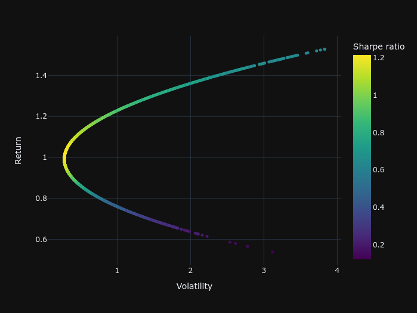

# Frontier

This is a small python module, build on top of `pystock` to help users visualize the efficient frontier of their portfolio. The module uses Monte-Carlo simulation to plot the frontier.

## How To Use

Here are the steps involved:

1. Create a `Portfolio`
2. Make sure that the data of stocks in the `Portfolio` is loaded
3. (Optional) You also need to calculate FFF parameters if you want to use FFF3 or FFF5 models.
4. That's all!

> Of course, you need to have the latest version of `pystock` module installed. Install it by using
>
> ```bash
> pip install --upgrade pystock0
> ```

## Example

Here is a simple example. Say you have a `Portfolio` like this:

```output
Portfolio(S&P 500, ['Apple', 'Google', 'Tesla', 'Microsoft'])
```

with all data loaded. All you have to is call:

```python
ef = EfficientFrontier(portfolio=Portfolio)
fig = ef.plot_frontier(short=True, model="capm")
fig.show()

```

This is how the plot will look like:


The module uses `plotly` which means you will get an interactive plot.

## Supported Models

As `frontier` is built on top of `pystock`, it supports all the models supported by `pystock`. The supported models are:

- CAPM (Capital Asset Pricing Model)
- SIM (Single Index Model)
- FFF3 (Fama-French 3 Factor Model)
- FFF5 (Fama-French 5 Factor Model)
